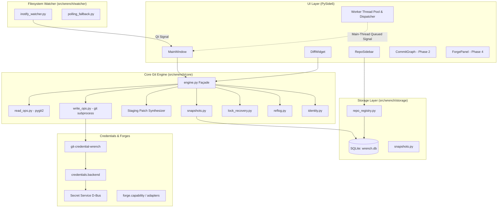

# Wrench Architecture

This document describes the design principles, component architecture, concurrency model, and data flow of **Wrench**.

---

## 1. Architectural Principles

Wrench is engineered around four non-negotiable architectural tenets:

1. **Hybrid Core Git Engine (Split Read/Write Responsibility)**:
   - **Read Operations** (`status`, `diff`, `log`, `blame`) are executed in-process using `pygit2` (libgit2 C bindings) for millisecond latency and structured in-memory traversal without process-spawning overhead.
   - **Write & Risky Operations** (`commit`, `branch`, `switch`, `merge`, `rebase`, `push`, `pull`, `fetch`, `credential negotiation`) are delegated to the system `git` CLI via subprocess. This guarantees 100% fidelity with git's battle-tested merge/rebase conflict handling, index updates, and credential protocols.
2. **Strict Layering & One-Directional Data Flow**:
   ```
   UI Layer (PySide6)
         │
         ▼
   Façade Layer (core.engine / forge.registry)
         │
   ┌─────┴───────────────────────┬────────────────────────┐
   ▼                             ▼                        ▼
   Read Engine (pygit2)     Write Engine (git CLI)   Forge Adapters (httpx)
   ```
   - **Rule**: UI code *never* directly imports `pygit2`, calls `subprocess`, or touches low-level database cursors. All interactions pass through the public `core.engine` and `forge.registry` façades.
3. **Thread Safety & Non-Blocking UI**:
   - Heavy write operations, network calls, and repository clones run in dedicated background threads (`ui.workers.run_in_background`).
   - Callback execution is marshalled back to the main GUI thread using Qt queued signals (`_Dispatcher`) to avoid thread race conditions and UI crashes.
4. **Local-First & Non-Destructive Safety**:
   - Every potentially destructive action is protected by safety systems (automatic pre-operation snapshots, stale lock recovery, and reflog recovery).

---

## 2. System Component Diagram



---

## 3. Component Breakdown

### 3.1 UI Layer (`src/wrench/ui/`)
- **`MainWindow` (`ui/main_window.py`)**: Root `QMainWindow` and lifecycle coordinator. Owns the active `RepoHandle`, the active `RepoWatcher`, and handles window level error dialogs.
- **`RepoSidebar` (`ui/sidebar/repo_sidebar.py`)**: Lists registered repositories, missing indicators, and provides quick repository switching.
- **`DiffWidget` (`ui/diff_view/diff_widget.py`)**: Read-only, syntax-highlighted diff viewer rendering hunks with line-number metadata. Provides hunk dropdown controls and whole-file/hunk staging buttons.
- **`workers.py`**: Background thread runner using `QThread` and a thread-safe `_Dispatcher` `QObject` via `Qt.ConnectionType.QueuedConnection` to ensure callbacks execute strictly on the main thread.

### 3.2 Core Git Engine (`src/wrench/core/`)
- **`engine.py`**: Public façade exposing unified, typed functions. Converts all internal exceptions into typed `WrenchGitError` derivatives (`WrenchRepoNotFoundError`, `GitCommandError`, `StagingError`, etc.).
- **`read_ops.py`**: `pygit2`-backed status, diffs, log traversal, and line-by-line blame.
- **`write_ops.py`**: Subprocess helper `run_git` managing process execution, environment sanitation (`GIT_TERMINAL_PROMPT=0`), timeouts, and command logging.
- **`lock_recovery.py`**: Manages `.git/index.lock` detection with a 5-second grace window to differentiate active operations from stale crash locks.
- **`snapshots.py`**: Captures working directory states into dangling Git commit objects (`git stash create`) and compresses untracked files into `.tar.gz` archives without altering working directory status.
- **`reflog.py`**: Reflog inspection and branch restoration.
- **`identity.py`**: Validates user name and email configurations, providing repo-local configuration setters.
- **`paths.py`**: Standardized XDG data, config, and state directory resolution via `platformdirs`.

### 3.3 File Watcher (`src/wrench/watcher/`)
- **`inotify_watcher.py`**: Utilizes `watchdog.observers.Observer` to monitor repository directories.
  - Excludes internal `.git/` directory operations.
  - Subscribes to `on_modified` and `on_moved` / `IN_MOVED_TO` events (crucial for capturing atomic file saves from editors that write to temp files and rename).
  - Employs a 300ms single-shot `QTimer` debounce filter to collapse bursts of events into a single notification.
- **`polling_fallback.py`**: Fallback polling loop when inotify handle limits (`ENOSPC`) are reached.

### 3.4 Local Data Storage (`src/wrench/storage/`)
- **`db.py`**: Manages SQLite connection (`wrench.db`) located in `$XDG_DATA_HOME/wrench/`.
  - Configured with `check_same_thread=False`.
  - Serialized through a single process-wide `threading.Lock()` to prevent SQLite concurrency deadlocks.
  - Automated corrupt database quarantine and recovery.
- **`repo_registry.py`**: Repository CRUD operations, tracking last opened times and relocated paths.
- **`schema.sql`**: Normalized relational schema with foreign key cascading deletes.

---

## 4. Key Workflows & Data Flows

### 4.1 Granular Staging Workflow
```
[User clicks 'Stage Hunk']
        │
        ▼
[ui.diff_view] calls core.engine.stage_hunk(repo, path, hunk_id)
        │
        ▼
[core.read_ops] retrieves structured Diff for path via pygit2
        │
        ▼
[core.engine] extracts target Hunk and formats unified diff patch:
        --- a/path
        +++ b/path
        @@ -old_start,old_count +new_start,new_count @@
        ...
        │
        ▼
[core.write_ops] writes patch to temp file and executes:
        git apply --cached <temp_patch>
        │
        ▼
[core.write_ops] cleans up temp file
        │
        ▼
[inotify_watcher] detects index change -> 300ms debounce -> triggers UI refresh
```

### 4.2 Non-Blocking Background Operations
```
[UI Trigger: Clone / Push / Fetch]
        │
        ▼
ui.workers.run_in_background(fn, *args, on_finished=cb, on_failed=err_cb)
        │
        ├── Spawns QThread & GitOperationWorker
        ├── Executes blocking git subprocess on background thread
        │
        ▼
[Background Thread Completes]
        │
        ├── Emits finished(result) or failed(error) Signal
        │
        ▼
[_Dispatcher QObject (Main Thread)]
        │
        └── Receives signal via Qt.QueuedConnection
        └── Executes on_finished / on_failed directly on Main GUI Thread
```

---

## 5. Relational Database Schema

```
┌──────────────────────────────┐       ┌────────────────────────────────────┐
│            repos             │       │      repo_identity_overrides       │
├──────────────────────────────┤       ├────────────────────────────────────┤
│ id (PK)                      │◄──────┤ repo_id (FK, PK)                   │
│ path (UNIQUE)                │       │ user_name                          │
│ display_name                 │       │ user_email                         │
│ last_opened_at               │       └────────────────────────────────────┘
│ is_missing                   │
└──────────────┬───────────────┘
               │
               ├───────────────────────┐
               ▼                       ▼
┌──────────────────────────────┐ ┌────────────────────────────────────┐
│          snapshots           │ │         repo_forge_links           │
├──────────────────────────────┤ ├────────────────────────────────────┤
│ id (PK)                      │ │ repo_id (FK, PK)                   │
│ repo_id (FK)                 │ │ remote_name (PK)                   │
│ trigger                      │ │ forge_account_id (FK)              │
│ label                        │ └─────────────────┬──────────────────┘
│ commit_sha                   │                   │
│ untracked_archive_path       │                   ▼
│ created_at                   │ ┌────────────────────────────────────┐
└──────────────────────────────┘ │           forge_accounts           │
                                 ├────────────────────────────────────┤
                                 │ id (PK)                            │
                                 │ provider                           │
                                 │ instance_url                       │
                                 │ label                              │
                                 │ username                           │
                                 │ secret_service_key                 │
                                 └────────────────────────────────────┘
```

---

## 6. Directory Structure

```
wrench/
├── bin/                          # Development helper binaries (symlinked to .venv/bin)
│   ├── wrench-run
│   ├── wrench-debug
│   ├── wrench-test
│   ├── wrench-lint
│   ├── wrench-format
│   └── wrench-ci-check
├── dev/
│   └── planning/                 # Architectural specifications, SRS & phase logs
│       ├── srs.md
│       ├── implementation-plan.md
│       └── phase-one.md
├── packaging/
│   └── flatpak/                  # Flatpak packaging manifests
├── src/wrench/
│   ├── app.py                    # Application bootstrap & logging configuration
│   ├── core/                     # Core Git engine & platform primitives
│   │   ├── engine.py             # Public unified façade
│   │   ├── read_ops.py           # pygit2 read operations
│   │   ├── write_ops.py          # subprocess CLI write operations
│   │   ├── lock_recovery.py      # Stale index.lock detection
│   │   ├── snapshots.py          # Rolling safety snapshots
│   │   ├── reflog.py             # Reflog operations
│   │   ├── identity.py           # Git author configuration
│   │   └── paths.py              # XDG / platformdirs path resolution
│   ├── forge/                    # Forge provider capability system
│   ├── storage/                  # SQLite storage & repository registry
│   ├── ui/                       # PySide6 desktop UI
│   │   ├── main_window.py        # Main application window
│   │   ├── workers.py            # Thread-safe background worker marshaller
│   │   ├── sidebar/              # Repository sidebar widgets
│   │   └── diff_view/            # Monospace diff viewer & staging controls
│   └── watcher/                  # Inotify filesystem watching & debouncing
└── tests/                        # Comprehensive test suite (unit, integration, UI)
```
